# ArtLounge3e

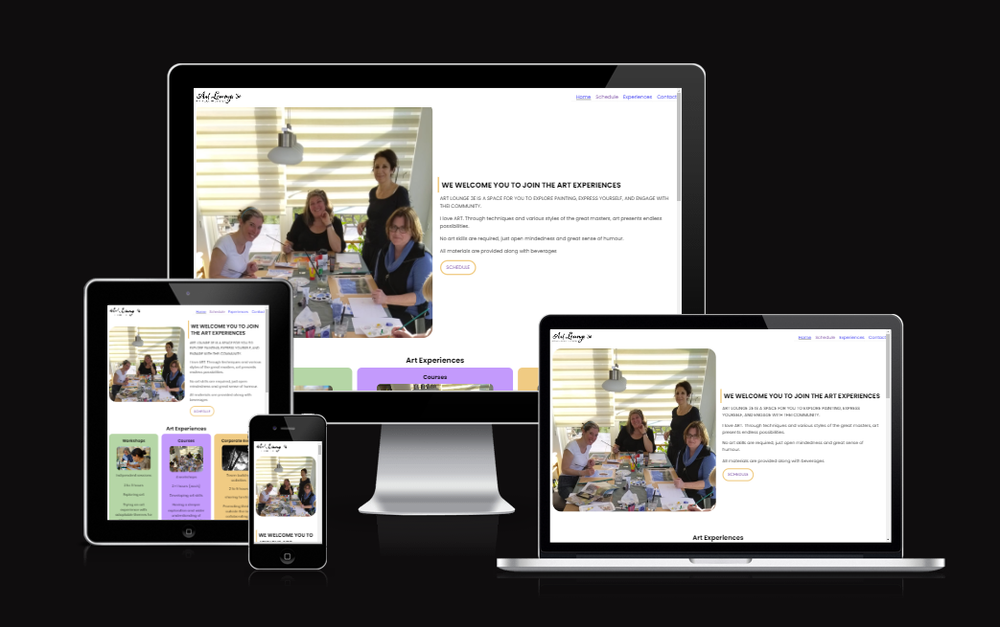

Art Lounge 3e is an Art Studio located in Lund, Sweden. It provides a variety of Art Exeperiences to private and Corporate customers.

The purpose of this website is to promote Art Lounge 3e providing information to potential customers about the renge of offers from the Art Studio, schedule of bookable events and contact options. The website targets an audience of new customers looking for the acivities being offered as well as returning customers looking to schedule a new event or find out about their new offerings.

Visit the deployed website [here](https://marcotoppino.github.io/ArtLounge3e/).

## Table of Contents

1. [User Experience (UX)](#user-experience-ux)
    1. [Project Goals](#project-goals)
    2. [User Stories](#user-stories)
    3. [Color Scheme](#color-scheme)
    4. [Typography](#typography)
    5. [Wireframes](#wireframes)
2. [Features](#features)
    1. [General](#general)
    2. [Landing Page](#landing-page)
    3. [Treatments Page](#treatments-page)
    4. [Book Now Page](#book-now-page)
    5. [404 Error Page](#404-error-page)
 3. [Technologies Used](#technologies-used)
    1. [Languages Used](#languages-used)
    2. [Frameworks, Libraries and Programs Used](#frameworks-libraries-and-programs-used)
4. [Testing](#testing)
    1. [Testing User Stories](#testing-user-stories)
    2. [Code Validation](#code-validation)
    3. [Accessibility](#accessibility)
    4. [Tools Testing](#tools-testing)
    5. [Manual Testing](#manual-testing)
5. [Finished Product](#finished-product)
6. [Deployment](#deployment)
    1. [GitHub Pages](#github-pages)
7. [Credits](#credits)
    1. [Content](#content)
    2. [Media](#media)
    3. [Code](#code)
8. [Acknowledgements](#acknowledgements)

***

## User Experience (UX)

### Project Goals

- The website should have a calming and relaxing design, appealing to the customers.

- Present the range of Art Experiences offered and information about them in order to attract more customers.

- Provide the customer with useful information that can facilitate future interaction with the business.

- Offer the customers the opportunity to book an Art Experience or to register their interest.

### User Stories

- As a customer, I want to be able to navigate the website intuitively and learn more about the business and Art Experiences being offered.

- As a customer, I want to be able to read more about the range of Art Experiences offered.

- As a customer, I want to be able to browse the schedule of bookable Art Experiences.

- As a customer, I want to be able to book an Art Experience directly from the website.

- As a customer, I want to find social media links to the business.

- As a customer, I want to easily find the contact information for the business.

### Color Scheme
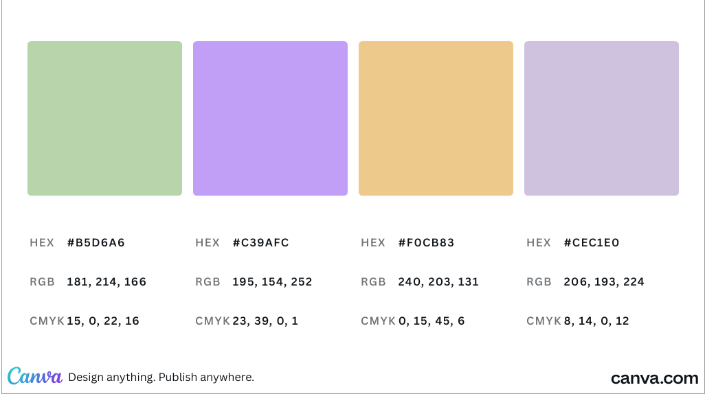

The colors used in the site are two different tones of Purple (#CEC1E0 and #C39AFC), a yellow color (#F0CB83) and green color (#B5D6A6). Tee light purple color is used for the structure elements of the website (Navigation Menu, links, separators), while the remaining three colors are connected with the three different range of Art Experiences offered (Workshops, Courses, Corporate). Purple has been chosen as it is broadly recognised as the "Art" colour, while yellow is connected with "Creativity".

### Typography

The main font used in the site is Poppins, with Sans Serif as the fallback font in case Poppins is not being imported correctly.

### Wireframes

Manual drawing on a [reMarkable 2](https://remarkable.com/) has been used to draw and develop, directly with the client, the appearance of the site and display the placement of the different elements whitin the pages.

Page | Desktop Version
--- | --- |
General | 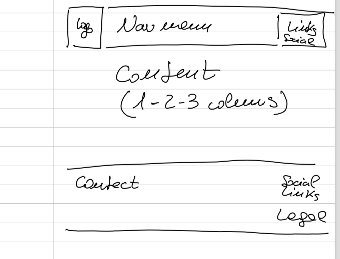
Index | 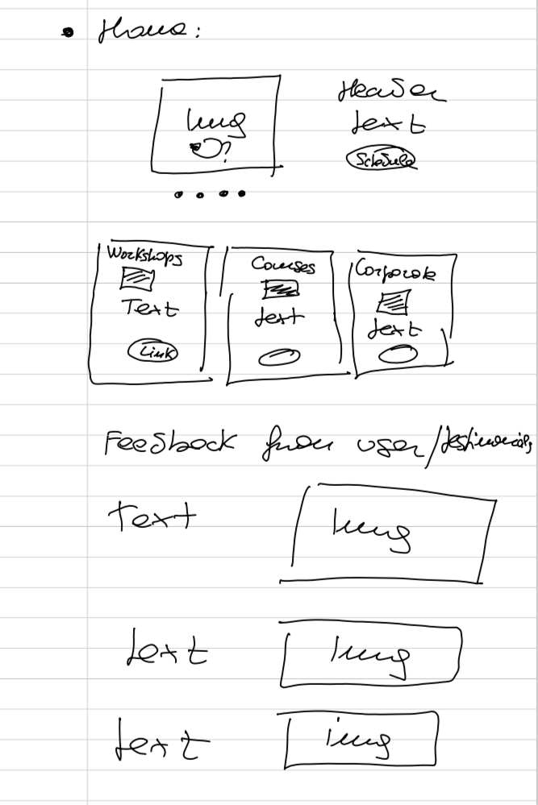
Schedule | 
Experiences | 
Contact | 

[Back to top ⇧](#pura-vida-spa)

## Features

### General

- Responsive design across all device sizes.

- Similar color scheme and design throughout all pages to effectively structure, categorise and present the information to the customers.

#### Header - Tablet/Desktop version

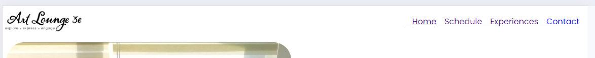
    
- The header contains the business logo and a fully responsive navigation bar positioned across the top of the screen.

- The business logo functions as a link to the landing page.

- The header is always visible and fixed on the top, to allow immediate navigation opportunity also during scrolling

- The navigation bar is identical in all pages and contains links to all pages to facilitate navigation across the site. It includes also an active page effect (underline)  to provide feedback to the customer for a better user experience.

#### Header - Mobile version

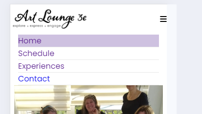
    
- The header contains the business logo and a fully responsive navigation bar positioned across the top of the screen.

- The business logo functions as a link to the landing page.

- The navigation bar is collapsed with an hamburger menu icon to allow maximum utilization of the screen area when navigation is not needed

- The header is always available and fixed on the top, to allow immediate navigation opportunity also during scrolling
    
- The navigation bar is identical in all pages and contains links to all pages to facilitate navigation across the site. It includes also an active page effect (background color)  to provide feedback to the customer for a better user experience.

#### Footer
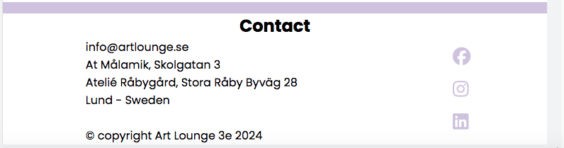

- The footer includes contact information and direct links to the business' social media channels (Facebook, Instagram, Linkedin).

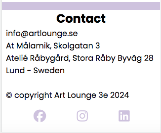
- The mobile version of the footer has a different layout for the social media links to better utilize the screen space and allow easier tapping of the links.

### Landing Page

#### Welcome Image and Text
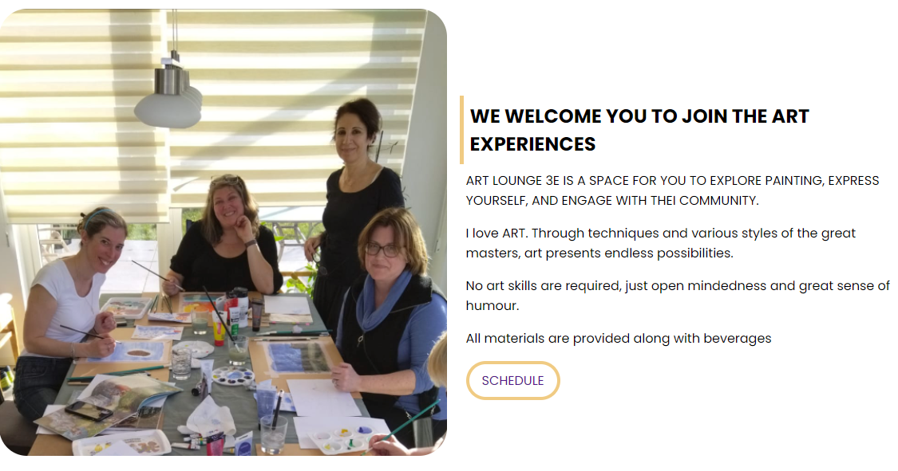

- The Welcome main image is designed to attract the customer attention showing the happy and relaxed athmosphere during the Art Sessions. The message is particularly aimed at attracting new customers with no specific art experience.
- A direct link to the schedule page is immediately provided, to allow returning customers to easily access the range of offerings

##### Experiences Section
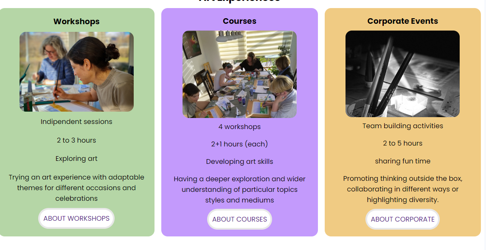

- Contains three sections for the three different types of offernig (Workshops, Courses, Corporate). They include summary of the offering, an image reflecting the different styles and a direct link to the relevant section for further deeper information.

#### Testimonials Section
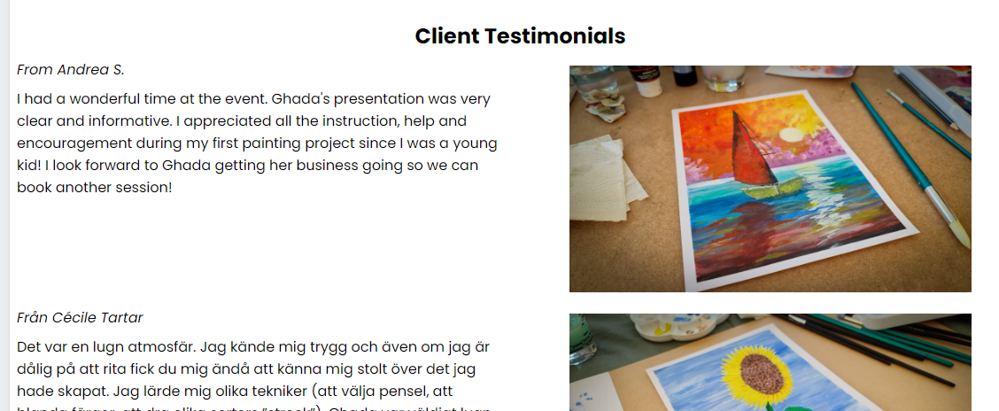
- Contains a selection of Client Testimonials, with name, direct feedback on the session(s) and an image of the output of the Art session. It provides also an immediate snapshot for the user on what he/she can expect to be producing during the sessions..

### Schedule Page

#### Welcome Section
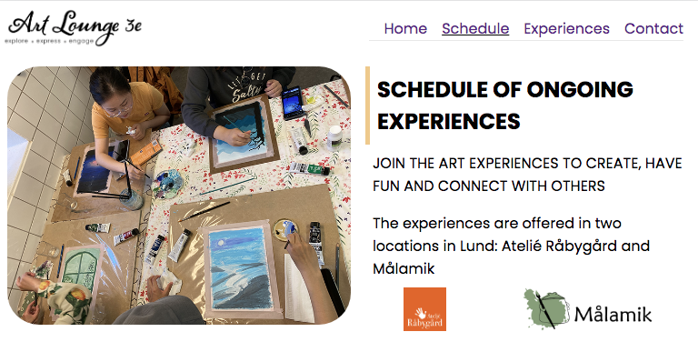
- The Welcome section contains an image of a past art session, along with general information about the locations where the sessions are offered. Partners logos (locations) are included, and act as links to the relevant websites.

#### Schedule Section

- The Schedule section features a list of bookable Art sessions. Each element shows a relevant image, the type of session, the date/time of the event and the cost information. A direct link to the contact page is provided for easy and immediate navigation.
   
### Experiences Page
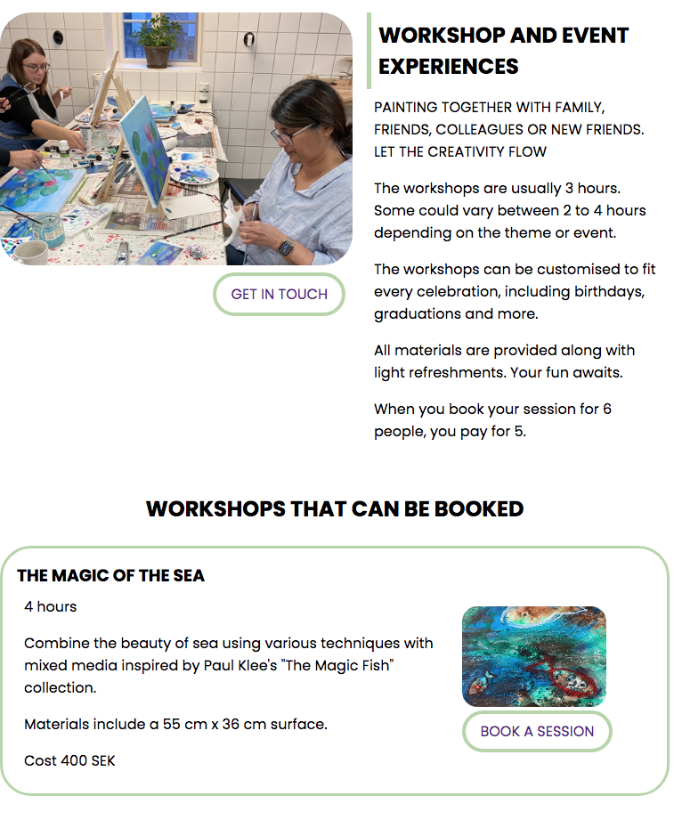

- The Experiences Page contains three sections for the three types of offerings. Each Secttion has a different color scheme, to differentiate the offering.
- Each section features also a list of Art Sessions that can be directly booked or registered for interest. Direct link is provided to allow easy and fast navigation to the contact page.

### Contact Page/Form

- The form allows the customer contact directly the business from the business website.
- The forms uses validated text inputs to guide the user through the form and minimize mistakes.
- All field are marked as required, to avoid to send empty messages.

[Back to top ⇧](#artlounge3e)

## Technologies Used

### Languages Used
* [HTML5](https://en.wikipedia.org/wiki/HTML5)
* [CSS3](https://en.wikipedia.org/wiki/CSS)

### Frameworks, Libraries and Programs Used

* [Google Fonts](https://fonts.google.com/)
    - Google Fonts was used to import the font Poppins into the style.css file. This font was used throughout the site.

* [Font Awesome](https://fontawesome.com/)
     - Font Awesome was used throughout all pages to add icons in order to create a better visual experience for UX purposes.

* [FavIcon.io](https://favicon.io/)
    - FavIcon.io was used to generate the FavIcon for the website.

* [GitPod](https://gitpod.io/)
     - GitPod was used for writing code, committing, and then pushing to GitHub.

* [GitHub](https://github.com/)
     - GitHub was used to store the project after pushing.

* [Am I Responsive?](http://ami.responsivedesign.is/#)
    - Am I Responsive was used in order to see responsive design throughout the process and to generate mockup imagery to be used.

* [Responsive Design Checker](https://www.responsivedesignchecker.com/)
    - Responsive Design Checker was used in the testing process to check responsiveness on various devices.

* [Chrome DevTools](https://developer.chrome.com/docs/devtools/)
    - Chrome DevTools was used during development process for code review and to test responsiveness.

* [W3C Markup Validator](https://validator.w3.org/)
    - W3C Markup Validator was used to validate the HTML code.

* [W3C CSS Validator](https://jigsaw.w3.org/css-validator/)
    - W3C CSS Validator was used to validate the CSS code.

[Back to top ⇧](#artlounge3e)

## Testing

### Testing User Stories
* As a customer, I want to be able to navigate the website intuitively and learn more about the business and Art Experiences being offered.

     - The website offers a intuitive structure for the customers to navigate and find the information they are looking for.

    - The navigation bar is clearly presented in all pages for the customers to find with ease and it is easily navigable.

* As a customer, I want to be able to read more about the range of Art Experiences offered.

    - The experiences page presents all Art sessions available, each on their own section.

    - Each element contains useful information about the respective Art session .

* As a customer, I want to be able to browse the schedule of bookable Art Experiences.
    - The schedule page provides a list of all bookable sessions.
    - each element contains useful information about the respective Art Session an d a direct link to the Contact page.

* As a customer, I want to be able to book an Art Experience directly from the website.
    - There are different opportunities, on multiple pages (experiences page, schedule page), where a direct link to the contact page is offered
    - The Contact page provides a form for the customer to book or registe for an Art session.

* As a customer, I want to easily find the contact information for the business.
   - All pages contains a clear contact section in the footer with all necessary business' contacts

* As a customer, I want to find social media links to the business.
    - The footer provides link to the business' social media channels.

### Code Validation

* The [W3C Markup Validator](https://validator.w3.org/) and [W3C CSS Validator](https://jigsaw.w3.org/css-validator/) services were used to validate all pages of the project in order to ensure there were no syntax errors.

    - W3C Markup Validator found an error concerning headings not being included on the main and book now images. The section tag was replaced for a div tag to correct this. 
    
    - Another error found by W3C Markup Validator was concerning a percentage value used inside the iframe tag to declare the width property on the Book Now page. The width and height properties for the iframe were declared inside the CSS file instead.

    -  W3C CSS Validator found no errors or warnings on my CSS.

### Accessibility

* Used Lighthouse in Chrome DevTools to confirm that the colors and fonts being used in throughout the website are easy to read and accessible.

* Lighthouse reports

    - **Landing Page**

    

    - **Treatments Page**

    

    - **Book Now Page**

    

    - **404 Error Page**

    

### Tools Testing

* [Chrome DevTools](https://developer.chrome.com/docs/devtools/)

    - Chrome DevTools was used during the development process to test, explore and modify HTML elements and CSS styles used in the project.

* Responsiveness
    
    - [Am I Responsive?](http://ami.responsivedesign.is/#) was used to check responsiveness of the site pages across different devices.

    - [Responsive Design Checker](https://www.responsivedesignchecker.com/) was used to check responsiveness of the site pages on different screen sizes.
    
    - Chrome DevTools was used to test responsiveness in different screen sizes during the development process.

### Manual Testing

* Browser Compatibility

    - The website has been tested on the following browsers:

        - **Goolgle Chrome**
        
        No appearance, responsiveness nor functionality issues.

        - **Safari**
        
        No appearance, responsiveness nor functionality issues.

        - **Microsoft Edge**
        
        No appearance, responsiveness nor functionality issues.

* Device compatibility

    - The website has been tested on multiple devices, including:

        - **MacBook Pro 15"**

        No appearance, responsiveness nor functionality issues.

        - **Dell Latitude 5300**

        No appearance, responsiveness nor functionality issues.

        - **iPad Pro 12.9"**

        No appearance, responsiveness nor functionality issues.

        - **iPad Pro 10.5"**

        No appearance, responsiveness nor functionality issues.

        - **iPhone XR**
        
        No appearance, responsiveness nor functionality issues.

        - **iPhone 7**

        No appearance, responsiveness nor functionality issues.

* Common Elements Testing

    - All Pages
        
        - **Header**

            - Clicking on the main logo will bring the customer back to the landing page.

        - **Navigation Bar**

            - Hovering on the different navigation bar's links will trigger hover effect, highlighting the link for the customer.

            - Clicking on the navigation bar's links will bring the customer to the specified page.
        
        - **Footer**
        
            - Clicking on the social media links will open the specific website on a new tab.

    - Treatments Page

        - Hovering on the book button link on each treatment section will trigger hover effect, highlighting the button for the customer.

        - Clicking on the book button link on each treatment section will bring the customer to the book now page.

    - Book Now Page

        - When filling out the book now form, the customer is required to complete all fields before submitting.
        
        - Hovering over the book button will trigger hover effect, highlighting the button for the customer.

        - Clicking and dragging on the map in the find us section will move the area shown on the map. 
        
        - Clicking the plus and minus buttons changes the zoom of the map.

    - 404 Error Page

        - Entering an incorrect address into the address bar will bring the customer back to the 404 error page.

        - Hovering on the homepage link will trigger hover effect, increasing the font size of the link's text.

        - Clicking on the homepage link will bring the customer back to the landing page.

[Back to top ⇧](#pura-vida-spa)

## Finished Product

Page | Desktop version | Mobile version
--- | --- | ---
Index |  | 
Treatments |  | 
Book Now |  | 
404 Error |  | 

[Back to top ⇧](#pura-vida-spa)

## Deployment

* This website was developed using [GitPod](https://www.gitpod.io/), which was then committed and pushed to GitHub using the GitPod terminal.

### GitHub Pages

* Here are the steps to deploy this website to GitHub Pages from its GitHub repository:

    1. Log in to GitHub and locate the [GitHub Repository](https://github.com/).

    2. At the top of the Repository, locate the Settings button on the menu.

        - Alternatively click [here](https://raw.githubusercontent.com/) for a GIF demostration of the process.

    3. Scroll down the Settings page until you locate the Pages section.

    4. Under Source, click the dropdown called None and select Master Branch.

    5. The page will refresh automatically and generate a link to your website.

[Back to top ⇧](#pura-vida-spa)

## Credits 

### Content

- All content was written by the developer.

### Media

* [Pexels](https://www.pexels.com/)

    - Main image: "Waterfalls in the Middle of Green Trees" by Austin Tsai.
    - 404 Error Page image: Taken by Artem Beliaikin.

* [Unsplash](https://unsplash.com/)

    - About Us image: "Pristine water lily" by Jay Castor.
    - Massage image: "Beautiful Woman Getting Stones Massage in Spa Salon" by Engin Akyurt.
    - Facial image: Taken by Raphael Lovaski.
    - Pedicure image: "Warm bath before treatment" by Rune Enstad.
    - Book Now image: Taken by Firos Nv.

### Code

* [Stack Overflow](https://stackoverflow.com/) and [W3Schools](https://www.w3schools.com/) were consulted on a regular basis for inspiration and sometimes to be able to better understand the code being implement.

[Back to top ⇧](#pura-vida-spa)

## Acknowledgements

* My partner, for her unconditional love, help and support in all aspects of life to make possible for me to work on this project.

* My family, for their valuable opinions and and critic during the design and development process.

* My tutor, Marcel, for his invaluable feedback and guidance.

* Code Institute and its amazing Slack community for their support and providing me with the necessary knowledge to complete this project.

[Back to top ⇧](#pura-vida-spa)