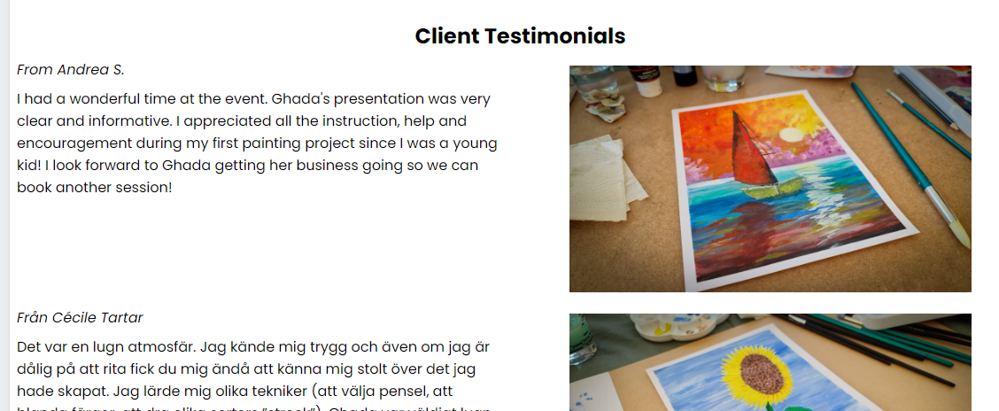

ArtLounge3e

This webside is dedicated to promote Art Lounge 3e.

Business goals are to:
- Attract new clients
- Sign-up for sessions
- Show a varied range of personalizable opportunities

Art Lounge 3e offers individuals an opportunity to seamlessly integrate newfound knowledge with their personal experiences. 
It is about bringing together a community who is curious to try new artistic endeavours. The art pieces created become personal expressions that can adorn your living space or serve as special gifts.

Features
Existing Features
Company Logo and Navigation Bar

Featured on all pages, the full responsive navigation bar includes links to the Logo, Home page, Schedule Experiences and Contact page and it is identical in each page to allow for easy navigation.
When visualised, it shows also the location of the page in the structure/active page, for easy navigation. The logo link brings always to the landing page

Landing Page

The page include a picture of an actual Art session, an inspirational welcome text, some basic information and a direct link to the Events Schedule

Furthe down there is a section dedicated to the three different types of Art Experiences Offered. Each type has a coded colour wich will be maintained in the relevant pages.

Further down a selection of Client Testimonials, to immediately show the good feedback from the experiences- The section acts also as a small gallery

The Footer

The footer section includes standard contact elements (mail, addresses) and links to the relevant social media sites for the company Art Lounge 3e or for the Company founder (Ghada Andersson)
All links open in a new page.

THe Schedule Page

The Experiences Page

The Contact Page

This page allows the user to write a message directly to the company e-mail address. Full name, e-mail address, subject and message text are mandatory

Features Left to Implement

-On the landing page, the main image should be converted in a carousel of images, with command buttons and possibly automatic rotation of the images
-The plain white background shoud be changed with something that resemples painting objects (brushes, colour tubes, etc....) embossed in a canvas.
-Under the main menu a separator is missing (while it is present over the footer) and should be covered by an irregular vertical stripes pattern.
-Schedule elements could appear (animation) from the bottom of the page to reach their final position
-A fully responsive image gallery
-An "About" page for the Company and the Owner
-A "Legal terms" page
-Direct link from the schedule events to a contact+bookig+payment page

Testing
Testing has been conducted checking all the links and assessing visibility on all screen resolutions (Crome dev tools)
Form controls were tested by manually including different combinations of text and e-mail.

Only on very large screens (4K) there is probably need of further testing for elements positioning/alignment

Validator Testing
HTML
No errors were returned when passing through the official W3C validator
CSS
No errors were found when passing through the official (Jigsaw) validator

Lighthouse Report
Lighthouse Report (Chrome Dev Tools) was used to asse the overall performance of the site.
No issues in Accessibility, Best Practices and SearchEngineOptimization.
Further optimization needed to improve the Performance score. 

Unfixed Bugs
No unfixed bugs

Deployment
The site was deployed to GitHub pages. The steps to deploy are as follows:
In the GitHub repository, navigate to the Settings tab
From the source section drop-down menu, select the Master Branch
Once the master branch has been selected, the page will be automatically refreshed with a detailed ribbon display to indicate the successful deployment.
The live link can be found here - https://marcotoppino.github.io/ArtLounge3e/contact.html

Credits

Content
The text for the different pages was developed together with the Art Lounge 3e owner
The icons in the footer were taken from Font Awesome
The responsive navbar structure and code (using CSS, no Java) was adapted from the CodeInstutute LoveRunning Project.

Media
All pictures are courtesy of Art Lounge 3e

Fonts, sizes and colours are courtesy of Art Lounge 3e Brand Identity